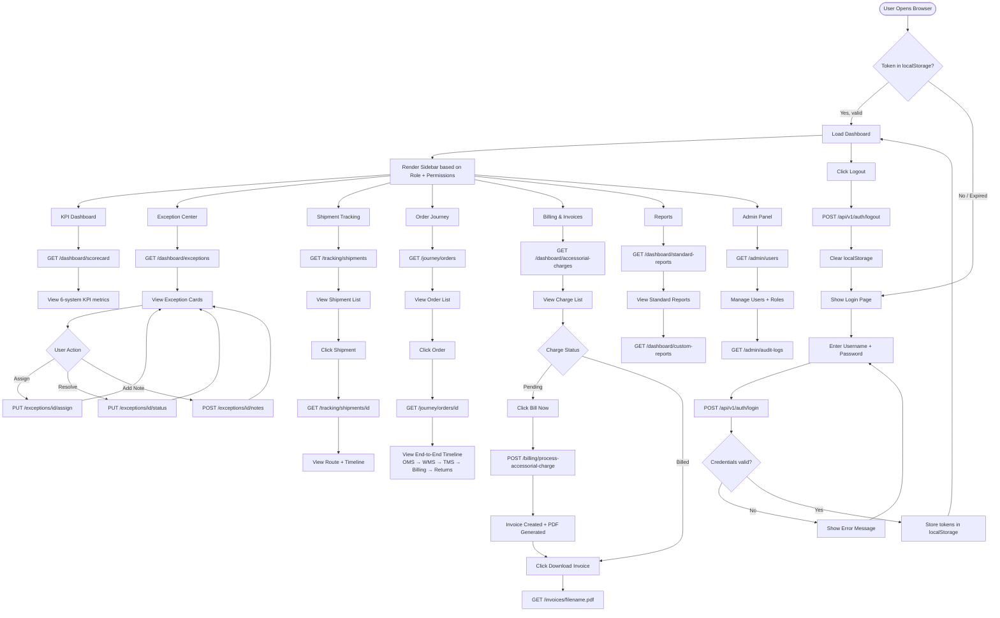

# Diagrams: User Flow & Entity Relationship (ER)

## Project: E-commerce Fulfillment Operations Control Tower

---

## HOW TO RENDER THESE DIAGRAMS

### ER Diagram (Section 2) — Best Method: dbdiagram.io
1. Go to **https://dbdiagram.io**
2. Click "Create your diagram"
3. Paste the **DBML code block** from Section 2A into the editor on the left
4. The ER diagram renders instantly on the right
5. Export as PNG, PDF, or share via link

### ER Diagram — Alternative: Mermaid (renders in VS Code)
1. Install the **"Markdown Preview Mermaid Support"** extension in VS Code
2. Open this file and press `Ctrl+Shift+V` to open the Markdown Preview
3. The Mermaid diagram in Section 2B will render inline

### User Flow Diagram (Section 1) — Mermaid in VS Code
1. Same steps as above — install the extension and preview this file
2. Or paste the Mermaid code block into **https://mermaid.live** for instant rendering

---

---

# Section 1 — User Flow Diagram

This diagram shows the complete journey a user takes through the system, from login through each major feature area.

---

---

# Section 2A — ER Diagram (DBML for dbdiagram.io)

The full schema is in a separate file to avoid rendering conflicts:

**File:** ER_SCHEMA_DBDIAGRAM.txt (in the same folder as this file)

**Steps:**
1. Open ER_SCHEMA_DBDIAGRAM.txt in VS Code
2. Select All (Ctrl+A) and Copy (Ctrl+C)
3. Go to https://dbdiagram.io and click "Create your diagram"
4. Paste into the left editor panel
5. The full ER diagram renders instantly on the right
6. Export as PNG or PDF

The schema covers all 7 databases: Auth, OMS, TMS, WMS, Billing, Returns, Yard, Exceptions — 23 tables total with all columns, constraints, and cross-database relationships marked.

---

# Section 2B — ER Diagram (Mermaid — renders in VS Code / mermaid.live)

Install **"Markdown Preview Mermaid Support"** in VS Code, then press `Ctrl+Shift+V`.
Or paste the code block contents into **https://mermaid.live**

```mermaid
erDiagram

    %% ── AUTH DB ──────────────────────────────────────

    USERS {
        int id PK
        string username
        string email
        string client_id
        string department
        datetime created_at
        datetime last_login
    }

    ROLES {
        int id PK
        string name
        string display_name
    }

    PERMISSIONS {
        int id PK
        string name
        string module
        string action
    }

    USER_ROLES {
        int user_id FK
        int role_id FK
    }

    ROLE_PERMISSIONS {
        int role_id FK
        int permission_id FK
    }

    USER_SESSIONS {
        int id PK
        int user_id FK
        string token
        string refresh_token
        datetime expires_at
    }

    AUDIT_LOGS {
        int id PK
        int user_id FK
        string action
        string resource_type
        string resource_id
        boolean success
        datetime created_at
    }

    %% ── OMS DB ───────────────────────────────────────

    ORDERS {
        int id PK
        string order_id
        string customer_id
        string status
        datetime order_date
        datetime promised_delivery_date
        float total_value
    }

    ORDER_LINES {
        int id PK
        string order_id FK
        string sku
        int quantity
        float line_total
    }

    %% ── TMS DB ───────────────────────────────────────

    SHIPMENTS {
        int id PK
        string shipment_id
        string order_id FK
        string carrier
        string status
        string origin
        string destination
        datetime estimated_delivery
        float cost
    }

    ROUTES {
        int id PK
        string route_id
        string driver
        string vehicle
        string status
        int total_stops
    }

    %% ── WMS DB ───────────────────────────────────────

    INVENTORY {
        int id PK
        string sku
        string product_name
        string warehouse_location
        int quantity_on_hand
        int reorder_point
    }

    PICKING_TASKS {
        int id PK
        string order_id FK
        string sku FK
        int quantity
        string status
        string assigned_to
        string priority
    }

    %% ── BILLING DB ───────────────────────────────────

    INVOICES {
        int id PK
        string invoice_id
        string customer_id
        string order_id FK
        datetime invoice_date
        string status
        float total
        float balance
    }

    BILLING_LINE_ITEMS {
        int id PK
        string invoice_id FK
        string service_type
        float quantity
        float line_total
    }

    %% ── RETURNS DB ───────────────────────────────────

    RETURNS {
        int id PK
        string return_id
        string order_id FK
        string customer_id
        string status
        string reason
        float refund_amount
    }

    RETURN_LINE_ITEMS {
        int id PK
        string return_id FK
        string sku
        int quantity
        string condition
    }

    %% ── YARD DB ──────────────────────────────────────

    DOCK_APPOINTMENTS {
        int id PK
        string appointment_id
        string dock_door
        string carrier
        string status
        datetime scheduled_time
        int expected_duration_minutes
    }

    YARD_LOCATIONS {
        int id PK
        string location_id
        string zone
        string status
        string carrier
    }

    %% ── EXCEPTION DB ─────────────────────────────────

    EXCEPTIONS {
        int id PK
        string exception_id
        string exception_type
        string severity
        string status
        string source_system
        string entity_id
        string assigned_to
        datetime detected_at
    }

    EXCEPTION_ACTIONS {
        int id PK
        string exception_id FK
        string action_type
        string performed_by
        datetime performed_at
    }

    EXCEPTION_RULES {
        int id PK
        string rule_id
        string source_system
        string condition_field
        string condition_operator
        string condition_value
    }

    %% ── RELATIONSHIPS ────────────────────────────────

    %% Auth
    USERS ||--o{ USER_ROLES : "assigned"
    ROLES ||--o{ USER_ROLES : "given to"
    ROLES ||--o{ ROLE_PERMISSIONS : "grants"
    PERMISSIONS ||--o{ ROLE_PERMISSIONS : "belongs to"
    USERS ||--o{ USER_SESSIONS : "has"
    USERS ||--o{ AUDIT_LOGS : "recorded in"

    %% OMS
    ORDERS ||--o{ ORDER_LINES : "contains"

    %% Cross-system (logical — enforced by application code)
    ORDERS ||--o{ SHIPMENTS : "shipped via"
    ORDERS ||--o{ PICKING_TASKS : "fulfilled by"
    ORDERS ||--o{ INVOICES : "billed as"
    ORDERS ||--o{ RETURNS : "returned via"

    %% WMS
    INVENTORY ||--o{ PICKING_TASKS : "picked from"

    %% Billing
    INVOICES ||--o{ BILLING_LINE_ITEMS : "itemised as"

    %% Returns
    RETURNS ||--o{ RETURN_LINE_ITEMS : "contains"

    %% Exceptions
    EXCEPTION_RULES ||--o{ EXCEPTIONS : "triggers"
    EXCEPTIONS ||--o{ EXCEPTION_ACTIONS : "tracked by"
```

